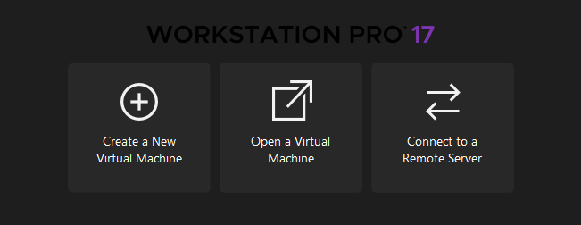

# Installation

To setup Active Directory, you should pick a Windows Server and Windows 11 Enterprise or Pro ISO.

## VMWare

You should first install a virtual machine, like VMWare.
- Link to VMware.

## Creating a Virtual Machine

Step I
- Create a new virtual machine

